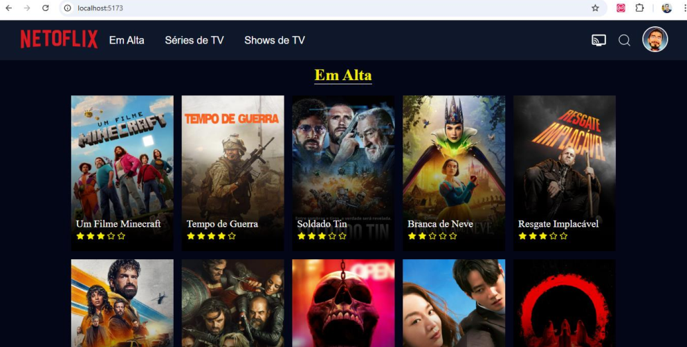

# Projeto Netoflix

O projeto consiste em um catálogo de filmes fornecido através de uma API pública: https://www.themoviedb.org/.

## Design do Projeto



## Como executar o projeto

1. Clonar o projeto ou baixar os arquivo para a sua máquina.
2. Instalar as dependências executando o comando abaixo dentro da pasta raiz do projeto:

```
npm i
```
3. Executar a aplicação com o comando: 

```
npm run dev
```
4. Abrir o endereço fornecido em algum navegador:
   
```
http://localhost:5173/ 
```

## Dev Log

**Aula 04 - 27/05 (terça)**

- [x] Criação da página secundária e criação das rotas com react-router-dom.
  - [x] Criação da página MovieDetails.jsx/css
  - [x] Criação do componente Stars.jsx/css
  - [x] Instação da biblioteca de itens react icons

**Aula 03 - 26/05 (segunda)**

- [x] Renderização das informações de filmes da api no corpo da página.
  - [x] Atualização do MovieContainer.jsx/css
  - [x] Atualização do MovieCard.jsx/css

**Aula 02 - 20/05 (terça)**

- [x] Criação de componentes e da conta para acessar a api TMDB.
  - [x] Criação da requisição para acessar os filmes da api
  - [x] Criação dos componentes MovieContainer e MovieCard

**Aula 01 - 19/05 (segunda)**

- [x] Criação do projeto com o comando **npm create vite@latest**.
  - [x] Criação dos componentes Header e Button
  - [x] Criação do componente Home para representar a página principal
